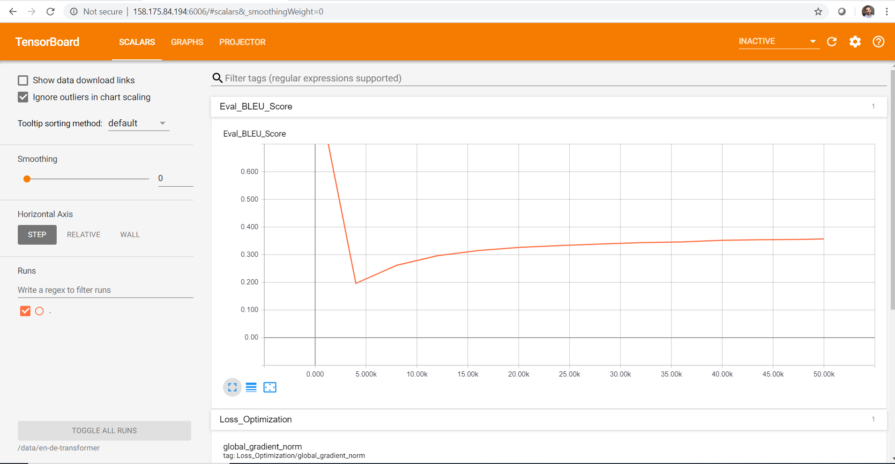
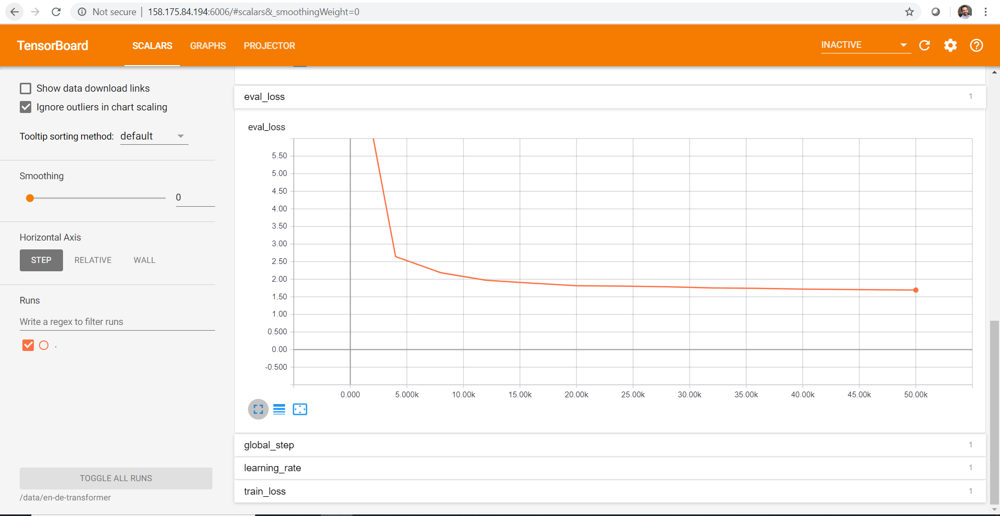
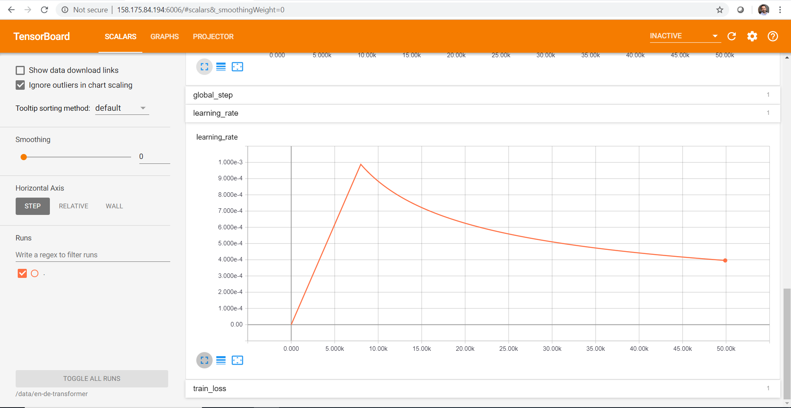

## ANSWERS

#### Questions

1. How long does it take to complete the training run? (hint: this session is on distributed training, so it will take a while)  
**It took approximately 12 hours to train the model (50,000 steps).**  

2. Do you think your model is fully trained? How can you tell?  
**No. The evaluation loss and the training loss were still droping at the step 50,000.**  

3. Were you overfitting?  
**No. The evaluation loss and the training loss were still droping together. The last values at 49990 were 1.6963 for the training loss and 1.6923 for the evaluation loss.**   

4. Were your GPUs fully utilized?  
**They were utilized in uneven peaks, but with a high utilization overall.**  

5. Did you monitor network traffic (hint: apt install nmon ) ? Was network the bottleneck?  
**Yes. The nmon showed that Recv and Trans were at ~440Mb most of the time.**  

6. Take a look at the plot of the learning rate and then check the config file. Can you explan this setting?  
**The plot has a sharp increase in the begining and then a slow decay takes place. This is due to the "warmup_steps:8000" which tells the optimizer to increase the learning rate linearly without decay in the first 8000 steps.**  

7. How big was your training set (mb)? How many training lines did it contain?  
**The raw (before data preparation) training set is composed of two files, one for german and one for english, with 695.4MB and 621.6MB respectively. Both files have 4,524,868 lines.**

8. What are the files that a TF checkpoint is comprised of?  
**There are 3 files: the data file with the variable values of the model itself, the .meta file that contains the graph structure of the model and the .index file that contains the metadata of the tensors and other auxiliary information. The files are listed below:**  

    ```  
    -rw-r--r-- 1 root root 730570768 Feb 29 10:19 val_loss=1.6923-step-50000.data-00000-of-00001
    -rw-r--r-- 1 root root     27441 Feb 29 10:19 val_loss=1.6923-step-50000.index
    -rw-r--r-- 1 root root  11980258 Feb 29 10:19 val_loss=1.6923-step-50000.meta
    ```  

9. How big is your resulting model checkpoint (mb)?  
**The checkpoint composed of by the sum of three files has 752.6MB.**

10. Remember the definition of a "step". How long did an average step take?  
**The training step refers to the model training passs on a single batch. On average each step took 0.818 seconds.**  

11. How does that correlate with the observed network utilization between nodes?  
**To update the gradients of the model during the training data must be exchanged between the nodes for the computations. Therefore, the high step time of almost 1 second is due to network limitations of the communication between nodes.** 

#### Tensorboard training progress
Training log file: [nohup.out](https://github.com/NVIDIA/OpenSeq2Seq/)

#### Tensorboard training progress

Evaluation Bleu Score:  
  

Evaluation Loss:  
  

Learning Rate:  
  

